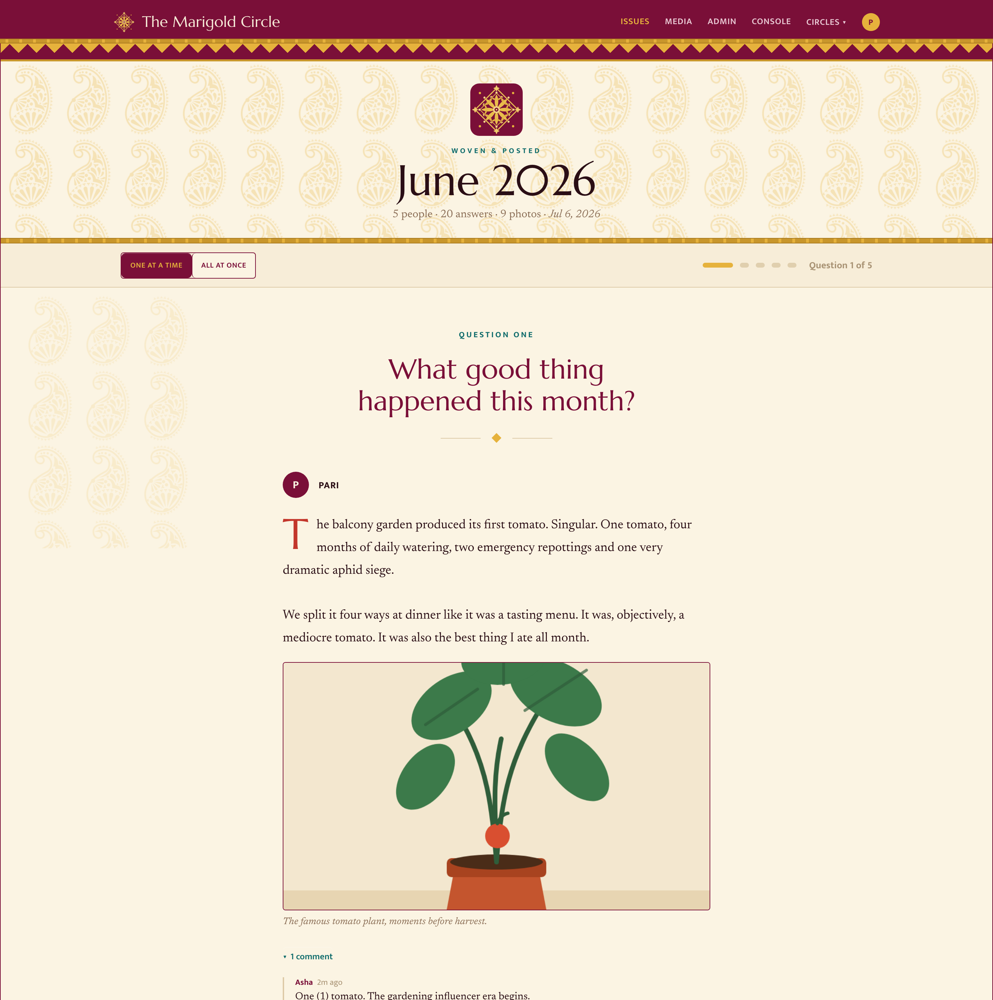

# PiecesOfLife

A self-hosted, private newsletter for a small circle of friends or family.

Each round, everyone answers a few questions in private — text, photos,
links, audio, video. When the round closes, the answers are woven into a
magazine-style issue for the whole circle to read and comment on. Then the
next round opens by itself.

No feeds, no likes, no public anything: your people, one URL, one SQLite
file.



## How it works

1. **Questions go out** — your default prompts, picks from a question
   bank, and suggestions members sent in while reading the last issue.
2. **Everyone answers in private.** Autosaving drafts; photos, link
   embeds, audio and video recorded straight from the browser; and a
   free-form **photo & video dump** for everything that didn't fit a
   question. Reminder emails chase the stragglers so you don't have to.
3. **The issue is published** — at the deadline automatically, or when the
   admin presses the button. Everyone gets an email that signs them
   straight into the reading view. The dump becomes the closing collage.
4. **The next round opens on schedule.** On a monthly cadence the whole
   thing runs itself.

Answering happens in a calm, autosaving editor, and running a round is a
single page for the admin — progress, one-click nudges, live question
editing, deadline extension, publish-now. Nothing gets lost afterwards:
every photo, video, and audio clip ever shared stays browsable under
Media, grouped by issue.

Between rounds there's **Ramble** — one private page per day for whatever
crossed your mind, in words, photos, video, or voice notes. Nobody sees a
word of it unless, when a round opens, you weave those days into the
issue: you get an editable copy to trim first (the journal itself never
changes), and it's published as a "From the notebooks" spread where every
day carries its own comment thread.

It reads just as well on a phone, login is passwordless (email magic
links), everything exports as JSON or a full ZIP — and one instance can
host **several circles**, each with its own members, rounds, and settings,
one login per person across all of them
([how that works](docs/multi-group.md)).

## Try it in two minutes

Development mode needs no mail account and no secrets — outgoing email is
captured in the logs, and `/dev/login` gives you instant sessions:

```bash
docker compose -f docker-compose.dev.yml up --build
```

Open <http://localhost:8090/dev/login?email=admin@example.com> and the
setup wizard takes it from there. Templates and static assets hot-reload
from your working tree.

## Deploy it

```bash
cp .env.example .env    # fill it in — every value is explained in the file
docker compose up -d --build
```

Or skip the build and use the prebuilt image with
`docker compose -f docker-compose.deploy.yml up -d`. Either way the
compose file refuses to start until `BASE_URL`, `FROM_EMAIL`,
`ADMIN_EMAIL`, and `SESSION_SECRET` are set — there are deliberately no
production defaults for those. Put any TLS-terminating reverse proxy in
front, and you're live.

The full walkthrough — environment reference, email delivery, the setup
wizard, your first round — is in
[docs/getting-started.md](docs/getting-started.md).

| Guide | What's in it |
|---|---|
| [Getting started](docs/getting-started.md) | Deploy → wizard → first published issue, plus the configuration reference |
| [Fastmail / JMAP email](docs/fastmail-jmap.md) | Send through a Fastmail API token instead of SMTP |
| [Upgrading](docs/upgrading.md) | Automatic migrations and backups, rehearsal, rollback |
| [Multi-circle design](docs/multi-group.md) | How several circles share one instance |

## Development

```bash
go test ./...                             # unit + integration tests (no network)
cd tests && npm install && npm run snap   # Playwright screenshot crawl of every page
```

Go + SQLite + server-rendered templates, one binary. The UI is a
hand-rolled design system ("Pallu", saree-textile inspired) in
`static/pallu.css`. Migrations are embedded and apply themselves on boot —
after snapshotting the database first.
